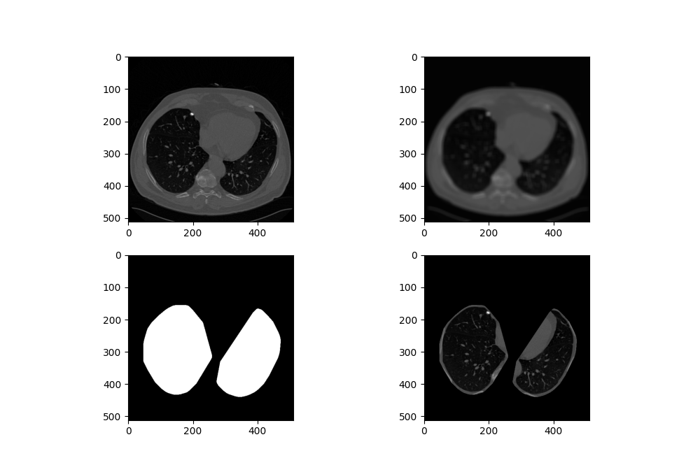
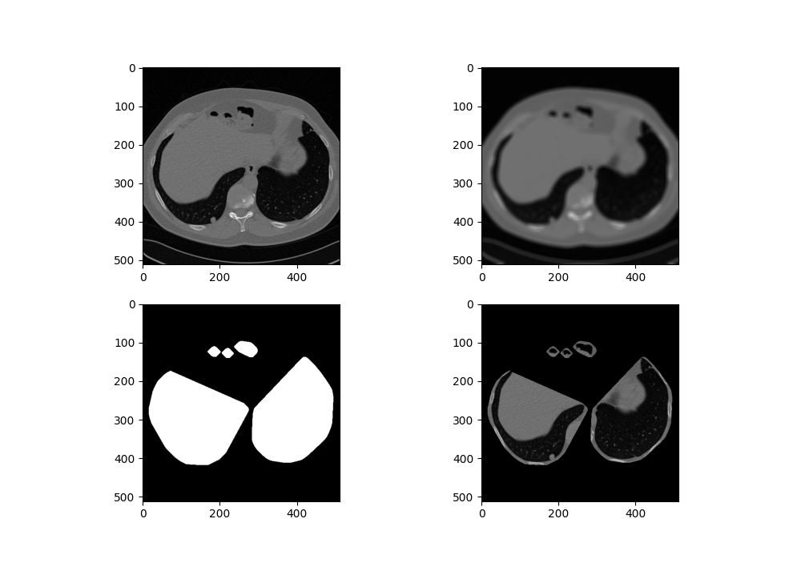
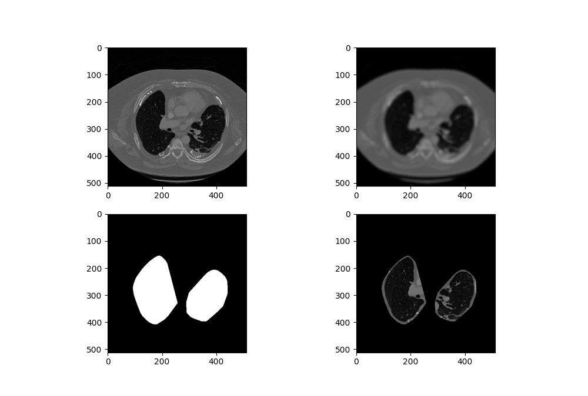
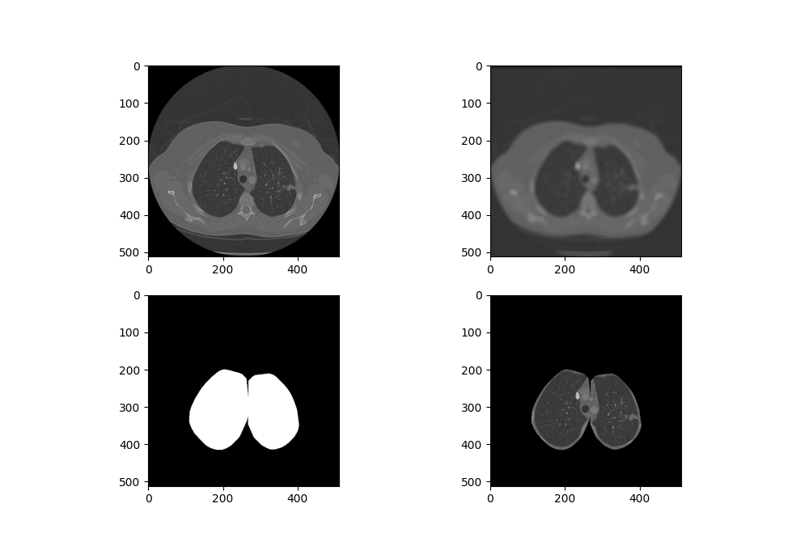

# Lung Cancer Detection (Detecção de Cancer de Pulmão)

**Universidade Federal de Alagoas - UFAL**

**Programa Institucional de Bolsa de Iniciação Científica - PIBIC**

**Título**: Auxílio Computadorizado à Identificação de Nódulos Pulmonares Baseado em Técnicas de Aprendizado Profundo

**Integrantes:**
- J.Y. Ramon A. Gonçalves (Processamento de imagem)
- Eduardo Silva (Machine Learning)
- [**Rodolfo Carneiro Cavalcante** (Orientador)](http://buscatextual.cnpq.br/buscatextual/visualizacv.do?id=K4480200Y9)

## **Sobre**

O câncer de pulmão é o tipo de câncer que mais causa mortes no mundo e sua principal manifestação ocorre devido ao aparecimento de lesões no tecido pulmonar. Dada a sua taxa de mortalidade, é muito importante que esse tipo de câncer seja identificado e diagnosticado o mais rápido possível. Diante disso, esse tipo de câncer vem sendo cada vez mais estudado e na tentativa de automatizar o processo de detecção – utilizando métodos de aprendizagem de máquina – comumente surgi alguns desafios – estando relacionados com a qualidade das imagens radiográficas –, sendo os principais: a quantidade de imagens, problemas com ruídos e distorções, além das regiões de interesse (ROIs) que são relativamente pequenas. Por isso, é de suma importância reduzir as áreas de buscas por possíveis nódulos, removendo ruídos e, consequentemente reduzindo as chances de erros de predição feitas pelas redes de Machine Learning. [Processamento de Imagem]

## **Processamento de imagem**

**Dados (data):** os subsets estão no formato array, contendo tuplas no formato: *tuple(matrix_pixel, array_points_nodules[tuple(axis_y, axis_x)])*. Os dados da matriz não estão normalizados.

[**lung_roi.py:**](lung_roi.py) arquivo destinado para segmentação da imagem e extração das regiões de interesse - pulmão - (ROI).

</br>

### **Resultados da Segmentação**

</br>

<p align="center">
  
  
  
  
  </br>
  <i>Processo de Segmentação: (1) imagem de entrada, (2) imagem com filtro Gaussiano, (3) máscara gerada, (4) extração.</i>
</p>
 
Para  constatação  da  validade  do  método  foram  utilizadas  apenas  imagens pulmonares que continuam nódulos, além de serem checados os resultados visualmente por um ser humano. As imagens foram classificadas em 3 tipo: (Excelente) regiões extraídas perfeitamente, (Ruim) imagens com problema que impossibilitam a utilização e (Aceitável) imagens que apresentam problemas na segmentacão porém não afetam regiões com nódulo.

```Os teste foram feitos com 1112 imagens, onde apenas 22 apresentaram problemas na segmentação. Dessas 22 imagens apenas 17 delas apresentou interferência na região do nódulo.```

<br>

<table align="center">
  <thead>
    <tr>
      <td>Classificação</td>
      <td>Quantidade</td>
      <td>Porcentagem (%)</td>
    </tr>
  </thead>

  <tbody>
    <tr>
      <td>Excelente</td>
      <td>1090</td>
      <td>98.02%</td>
    </tr>
    <tr>
      <td>Aceitável</td>
      <td>5</td>
      <td>0.46%</td>
    </tr>
    <tr>
      <td>Ruim</td>
      <td>17</td>
      <td>1.52%</td>
    </tr>
    <tr>
      <td>Total</td>
      <td>1112</td>
      <td>100%</td>
    </tr>
  </tbody>
</table>

<p align="center">
  <i>Tabela de resultados.</i>
</p>
